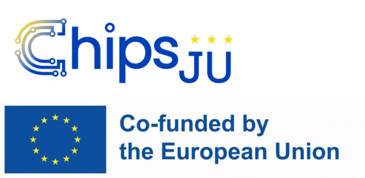

# PhaseFromInterferograms

Part of the [Phase.jl](https://github.com/JuliaPhase/Phase.jl) ecosystem.

<!-- DOI badge: add after first Zenodo release -->

## Overview

> **Note:** this overview is a temporary README generated by AI (Claude) and has not yet been reviewed by the author.

PhaseFromInterferograms provides algorithms for retrieving the phase from one or several interferograms: phase-shifting (PSI) with known or estimated tilts, phase retrieval from several tilted interferograms, tilt estimation from the Fourier spectrum (including zoomed FFT), and helpers for aperture detection and windowing.

## Funding

This work has received funding from the ECSEL Joint Undertaking (JU) under grant agreement No 826589 (MADEin4). The JU receives support from the European Union's Horizon 2020 research and innovation programme and France, Germany, Austria, Italy, Sweden, Netherlands, Belgium, Hungary, Romania and Israel.

This work has received funding from the Chips Joint Undertaking (JU) under grant agreement No 101111948 (14AMI). The JU receives support from the European Union's Horizon Europe research and innovation programme. The project is supported by the Chips Joint Undertaking and its members including the top-up funding by RVO (The Netherlands Enterprise Agency).

